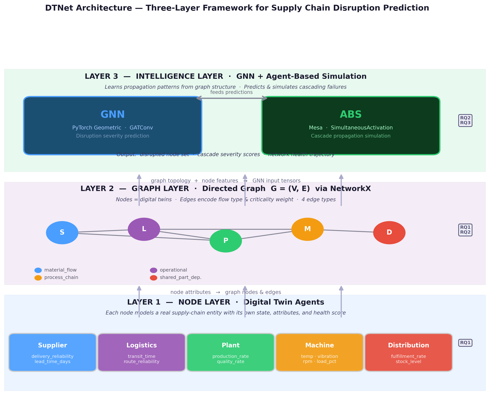
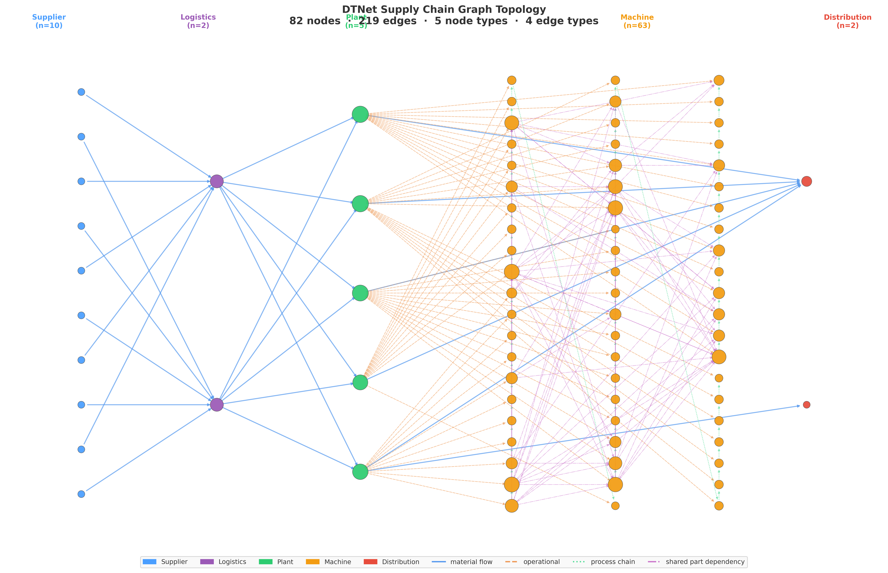

# DTNet

Master's thesis, HEC Lausanne, Master in Data Science, 2025-2026.

Models an industrial supply chain as a directed graph of stateful digital twins and trains a Graph Attention Network on agent-based simulation data to predict cascading disruptions. A non-graph (isolated twin) baseline is included for comparison.

**Research questions:**
- RQ1: How to represent a supply chain as a directed graph of digital twins, and which node/edge attributes capture entity state and inter-dependency?
- RQ2: How can a GNN trained on agent-based simulation predict cascading failures across this graph?
- RQ3: Does the networked approach outperform isolated (non-graph) twins for disruption prediction?

---

## Results

Numbers from `results/results_summary.json` (held-out test set) and `results/robustness_results.json` (mean over 5 seeds: 42, 123, 456, 789, 1024).

| Metric | DTNetGNN | Isolated Baseline | Delta |
|---|---|---|---|
| R² | 0.68 | 0.28 | +0.40 |
| F1 (5-seed mean) | 0.703 | 0.255 | +0.448 |
| AUC (5-seed mean) | 0.856 | 0.656 | +0.200 |
| MAE | 0.078 | 0.124 | -0.046 |

DTNetGNN outperforms the isolated baseline on all metrics across all 5 seeds (RQ3: yes). In the critical-hub scenario (disrupting the highest-betweenness node), 71 of 82 nodes were disrupted within 1 step. In the all-suppliers scenario, network health fell to approximately 66%.

Figures: `results/fig_robustness_comparison.png`, `results/fig_seeds_stability.png`, `results/fig_scenario_comparison.png`, `results/fig_full_graph.png`, `results/fig_loss_curves.png`.

---

## Architecture



The graph has 82 nodes and 219 edges across 5 node types (supplier, logistics, plant, machine, distribution) and 4 edge types. Each node is a Mesa agent with type-specific attributes and a health score. Edges carry `criticality_weight`, `flow_capacity`, and `latency_days`.

The GNN (`DTNetGNN`) is a two-layer Graph Attention Network with two output heads: a regression head for disruption severity and a binary classification head for disrupted/not. Node features are 16-dimensional: 10 twin features concatenated with 6 structural features (degree, betweenness, in/out-degree norm, closeness, pagerank). Training configuration: `hidden=128`, `heads=(4,1)`, `edge_dim=3`, 78,466 trainable parameters. The isolated baseline (`IsolatedBaseline`) is a single-layer MLP with 2,434 parameters.



---

## Data

`data/raw/updated_data.csv` is included in the repository (219,200 rows x 21 columns, "Machine Demand & Failure Prediction" dataset). No download needed.

---

## Setup

Python 3.10+. GPU is optional; training runs on CPU. GPU training was done on Google Colab.

```bash
git clone <repo-url>
cd DTNet/Prototype

python -m venv .venv

# Windows
.venv\Scripts\activate
# macOS / Linux
source .venv/bin/activate

pip install -r requirements.txt
```

`torch-geometric` requires a matching PyTorch build. For GPU support, install the correct CUDA wheel from pytorch.org first, then install `torch-geometric` per the PyG installation guide.

On Windows, set `$env:PYTHONUTF8="1"` in PowerShell before running any script. Preprocessing output contains Unicode characters that the default `cp1252` codec cannot handle.

---

## Running

Full pipeline (7 steps, 15-60 min depending on hardware):

```bash
python run_all.py
```

Steps in order:
1. Preprocess raw CSV -> `data/processed/processed.csv`
2. Build the DTNet graph (82 nodes, 219 edges)
3. Generate simulation training data -> `data/processed/simulation_runs.pkl` (5,000 runs)
4. Train DTNetGNN + IsolatedBaseline -> `results/dtnet_gnn_best.pt`
5. Evaluate on test set -> `results/results_summary.json`
6. Robustness evaluation across 5 seeds -> `results/robustness_results.json`
7. Generate figures -> `results/`

Individual modules:

```bash
python -m src.data.preprocess
python -m src.simulation.generate_data
python -m src.gnn.train
python -m src.gnn.evaluate
python -m src.gnn.evaluate_robust
python -m src.viz.architecture_viz
python -m src.viz.full_graph_viz
python -m src.viz.scenario_analysis_viz
python -m src.viz.robustness_viz
```

Dashboard (agent-based simulation only, no GNN inference):

```bash
streamlit run dashboard/app.py
```

Controls: propagation decay, threshold, severity, and 4 scenarios (random node, critical hub, all suppliers, bottleneck plant). Shows before/after network state, summary metrics, and a per-step timeline slider.

---

## Repo structure

```
Prototype/
├── data/
│   ├── raw/            # updated_data.csv (219,200 rows, included in repo)
│   └── processed/      # generated by run_all.py (gitignored)
├── src/
│   ├── agents/         # one agent class per node type
│   ├── data/           # loader, preprocess, entity_mapping
│   ├── graph/          # topology, builder, metrics
│   ├── simulation/     # Mesa model, scenarios, data generator
│   ├── gnn/            # model, dataset, train, evaluate, tune
│   └── viz/            # figure generation modules
├── dashboard/
│   └── app.py          # Streamlit demo
├── notebooks/          # exploratory notebooks, phases 1-5
├── results/            # figures (300 DPI PNG) and JSON summaries
├── run_all.py          # full pipeline
└── requirements.txt
```

---

## Dependencies

| Component | Library | Version |
|---|---|---|
| Graph | NetworkX | 3.6.1 |
| Agent simulation | Mesa | 3.5.1 |
| GNN | PyTorch Geometric (GATConv) | torch 2.11.0 / pyg 2.7.0 |
| Data | Pandas / NumPy / Scikit-learn | 3.0.2 / 2.4.4 / 1.8.0 |
| Visualisation | Matplotlib / Seaborn / Plotly | 3.10.8 / 0.13.2 / 6.6.0 |
| Dashboard | Streamlit | 1.56.0 |

---

Hamza Karmouche, hamza.karmouche@unil.ch
Master in Data Science, HEC Lausanne

Supervisor: Prof. Yash Raj Shrestha, HEC Lausanne, Department of Information Systems
